# Tiramisù Vegano 🌱

**Dosi:** 6 persone | **Teglia:** ~26,5×16,5 cm

> Approfondimenti: [Principi teorici](principi.md)  
> Biscotti: digestive (qui sotto), oppure [savoiardi artigianali](savoiardi.md)

---

## Lista della Spesa

| Ingrediente                                 | Quantità                                                                                           |
| ------------------------------------------- | -------------------------------------------------------------------------------------------------- |
| **Ceci in scatola** (per l'aquafaba)        | ~1 lattina da 400 g (per ottenere ~135 g di liquido → 90 g ridotta, oppure ~78 g se riduci di più) |
| **Zucchero a velo**                         | 30 g                                                                                               |
| **Zucchero semolato**                       | 40 g                                                                                               |
| **Amido di mais**                           | 20 g                                                                                               |
| **Cremor tartaro**                          | mezza punta (~1 g) — *da prendere solamente per sicurezza; potrebbe non servire*                   |
| **Essenza di vaniglia liquida**             | 1 flaconcino (8–10 gocce crema pasticcera + mezza 8-10 gocce per l'acqua faba montata a neve)      |
| **Latte vegetale di soia** (senza zuccheri) | 200 ml                                                                                             |
| **Marsala**                                 | 25 ml                                                                                              |
| **Curcuma**                                 | 1 pizzico                                                                                          |
| **Cremoso Valle** (mascarpone vegetale)     | 250 g                                                                                              |
| **Biscotti digestive**                      | ~200 g                                                                                             |
| **Caffè** (per inzuppare)                   | ~2 tazzine di caffè                                                                                |
| **Cacao amaro in polvere**                  | q.b. (da aggiungere solo al momento di servire)                                                    |

> **Cremor tartaro:** vale la pena averlo in casa. Nell'ultima versione con aquafaba ridotta fino a **78 g** è montata bene con lo zucchero a velo **senza utilizzare il** cremor tartaro. Aggiungilo solo se la montata resta molle o non prende corpo e non troppo, altrimenti la crema diventa acida.

> **Savoiardi invece dei digestive?** Lista e procedimento in [savoiardi.md](savoiardi.md)

---

## Ingredienti Dettagliati per Componente

### 1. Crema Pasticcera Vegana

| Ingrediente                             | Quantità   |
| --------------------------------------- | ---------- |
| Latte vegetale di soia (senza zuccheri) | 200 ml     |
| Amido di mais                           | 20 g       |
| Zucchero semolato                       | 40 g       |
| Marsala *(unito a freddo)*              | 25 ml      |
| Curcuma                                 | 1 pizzico  |
| Essenza di vaniglia                     | 8–10 gocce |

### 2. Crema al Mascarpone Vegetale

| Ingrediente                                                 | Quantità |
| ----------------------------------------------------------- | -------- |
| Cremoso Valle (mascarpone vegetale, a temperatura ambiente) | 250 g    |

### 3. Meringa di Aquafaba

| Ingrediente                  | Quantità                                                        |
| ---------------------------- | --------------------------------------------------------------- |
| Aquafaba                     | ~135 g da ceci in scatola scolati → 78 g (ridotta e fredda);    |
| Cremor tartaro               | mezza punta rasa (~1 g) — *facoltativo, solo se non monta bene* |
| Essenza di vaniglia          | mezza boccetta (~10–12 gocce)                                   |
| Zucchero a velo (setacciato) | 30 g                                                            |

### 4. Biscotti

| Ingrediente        | Quantità                          |
| ------------------ | --------------------------------- |
| Biscotti digestive | ~200 g                            |
| *oppure* savoiardi | vedi [savoiardi.md](savoiardi.md) |

---

## Da fare PRIMA (almeno 2–4 ore in anticipo)

> Queste preparazioni vanno in frigo per almeno 4 ore prima di procedere (devono essere belle fredde).

**Aquafaba ridotta:** Scola circa **135 g di liquido** e riduci di un terzo fino a **78 g**. Se fai anche i [savoiardi](savoiardi.md), riduci insieme ~350 g di liquido → ~235 g (145 g savoiardi + 90 g / 78 g meringa) in due contenitori. I ceci possono essere conservati in freezer in sacchettini o in frigo per massimo 3 giorni.

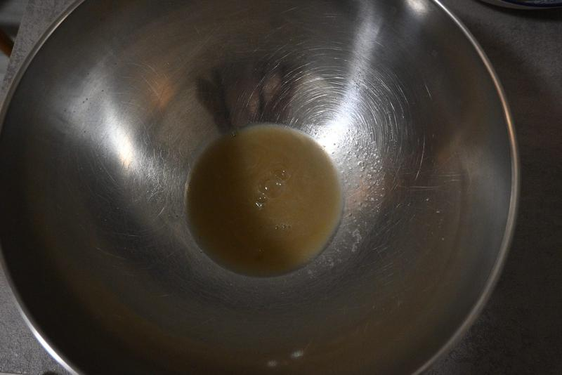

**Caffè:** Prepara **1 moka da 3 persone** (circa due tazzine di caffè). Usalo **tiepido** al momento dell'assemblaggio — non bollente.

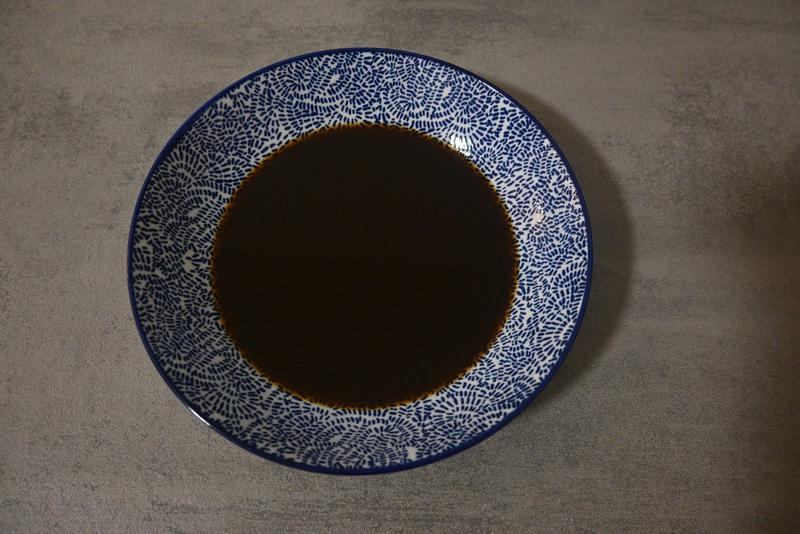

**Cremoso Valle:** Tira fuori dal frigo almeno 30 minuti prima di usarlo: deve essere a temperatura ambiente, morbido e lavorabile.

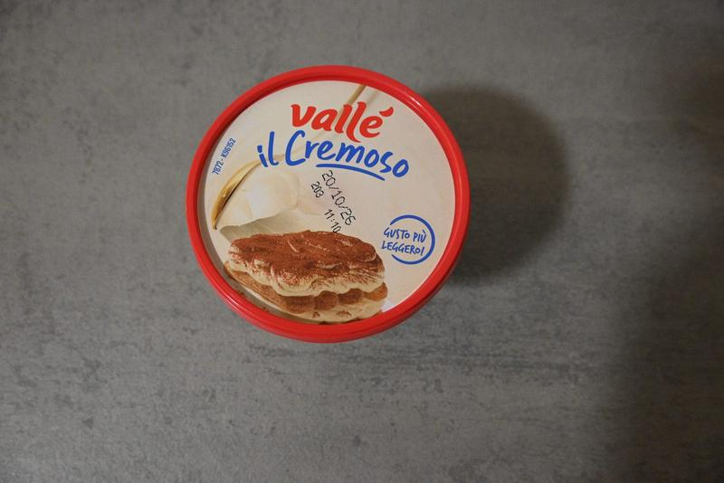

---

## Procedimento

### Parte 1 — Crema Pasticcera Vegana

1. In un pentolino, mescola a **freddo** i 20 g di amido e i 40 g di zucchero con una piccola parte dei 200 ml di latte vegetale, per evitare grumi.
2. Aggiungi il resto del latte, il Marsala, la curcuma, le 8–10 gocce di vaniglia.
3. Metti sul fuoco a **bassa potenza** (induzione livello 6 su 9) e mescola continuamente con una frusta finché non si addensa.
4. **Raffreddamento rapido:** Togli dal fuoco, versala in una ciotola larga e coprila subito con **pellicola a contatto** con la crema. Se non hai tempo (motivo per cui questo passaggio consiglio di farlo con calma anche il giorno prima) immergi la ciotola in un'altra più grande piena di acqua e ghiaccio e poi in freezer appena si è raffreddata un po' fino a che non raggiunge più o meno i 20° (10-15 minuti di freezer dovrebbero bastare a occhio). Deve essere completamente fredda prima del passo successivo.

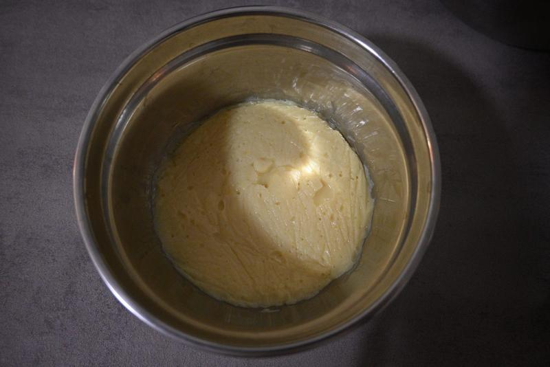

### Parte 2 — Crema al Mascarpone Vegetale

1. Porta la crema pasticcera in una ciotola capiente e inizia piano piano a mescolarla con le fruste (a bassa potenza) in modo tale da ottenere nuovamente un composto cremoso (cerca di evitare che si formino grumi, se vuoi essere più sicuro puoi anche setacciarla in un colino prima di mescolarla con le fruste).

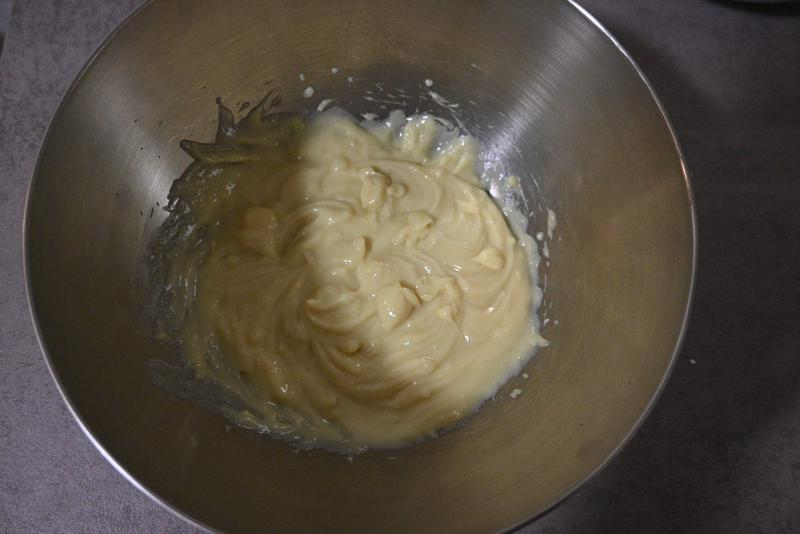

1. Aggiungi il Cremoso Valle (a temperatura ambiente) **poco per volta**, lavorando con le fruste elettriche ad ogni aggiunta.
2. Continua fino a ottenere una crema **liscia, uniforme e vellutata**, senza grumi (il sapore non dovrebbe essere troppo dolce, bensì fresco ed equilibrato).

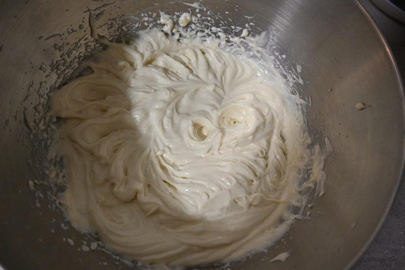

1. Se non usi subito la meringa, copri con pellicola e metti in frigo.

### Parte 3 — Meringa di Aquafaba

Nota: assaggia sempre il composto di partenza e mano mano che monti o stai per aggiungere composti (e.g cremor tartaro o zucchero a velo) in modo tale da capire quando fermarti senza farlo diventare nè troppo dolce, nè troppo acido o salato equilibrando bene con la vaniglia.

1. Versa i **78 g** di aquafaba fredda in una ciotola capiente (crescerà molto di volume), **perfettamente pulita e sgrassata**.
2. Inizia a montare a **velocità media**, **senza** cremor tartaro.
3. Quando si forma una schiuma bianca, alza la velocità al **massimo**. Continua finché non vedi solchi e il composto prende corpo.

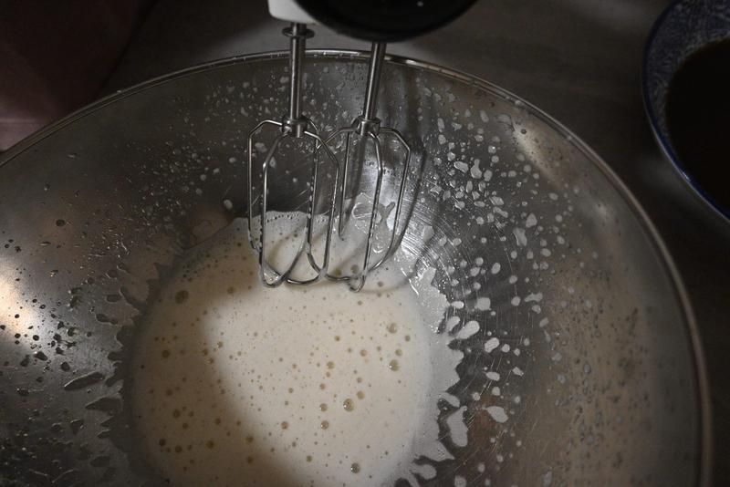

1. **Cremor tartaro (solo se serve):** se dopo qualche minuto resta molle, non forma solchi o non tiene, aggiungi mezza punta rasa e continua. Se monta già bene da sola, saltalo.
2. Versa la mezza boccetta di essenza di vaniglia. Se ti sembra poco, aggiungi qualche goccia in più.
3. Setaccia i 30 g di zucchero a velo direttamente nella ciotola in **2–3 riprese** (non tutto in una volta). Aziona le fruste per qualche secondo tra un'aggiunta e l'altra. Lo zucchero dovrebbe completare densità e lucentezza anche senza acidi.

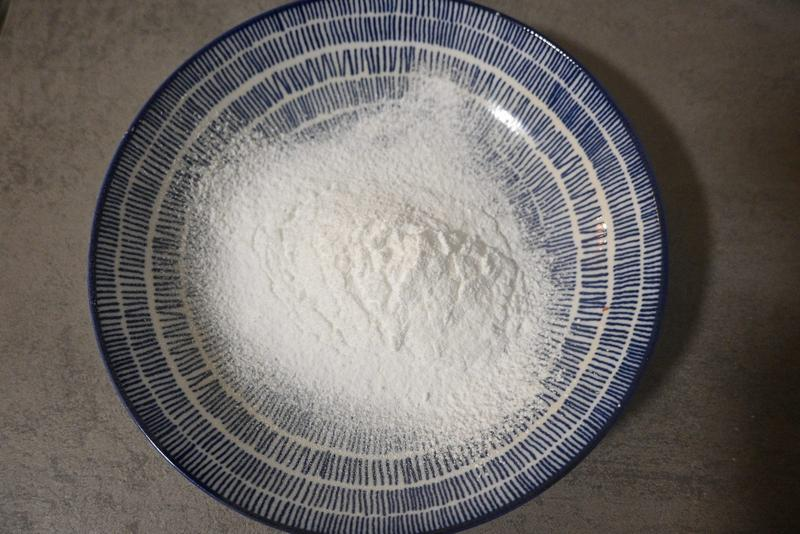

1. Monta per circa **10 minuti** totali: la meringa passerà da neve opaca a **lucidissima, liscia, densa e corposa**, esattamente come la schiuma da barba.

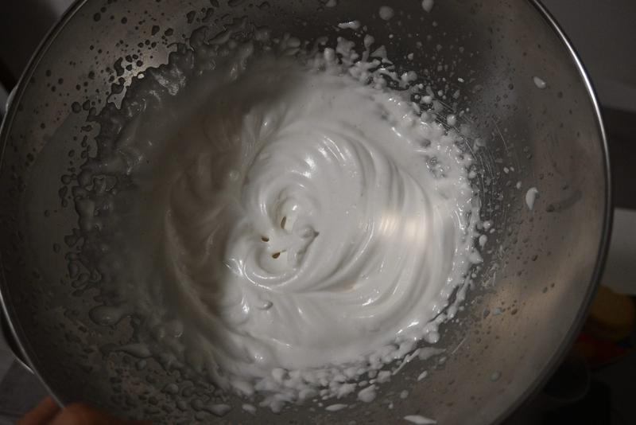

> Appena raggiungi questo effetto "schiuma da barba lucida", **spegni tutto**.

> **Test della ciotola capovolta:** se la meringa resta ferma anche con la ciotola rivoltata, la consistenza è giusta.

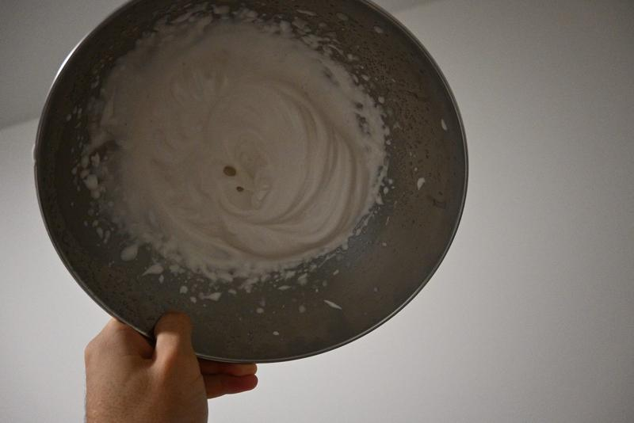

### Parte 4 — Unione della Crema

> Tratta il composto con delicatezza (movimento a J):

1. Aggiungi la super-meringa di aquafaba alla crema al mascarpone in **2–3 riprese** (mai tutta in un colpo).
2. Usa la spatola con il **movimento a "J"**: taglia al centro, scendi sul fondo, risali lateralmente ribaltando l'impasto, ruota la ciotola.
3. **Fermati non appena il colore è uniforme.** Non mescolare ulteriormente — l'aria scappa.

---

## Assemblaggio

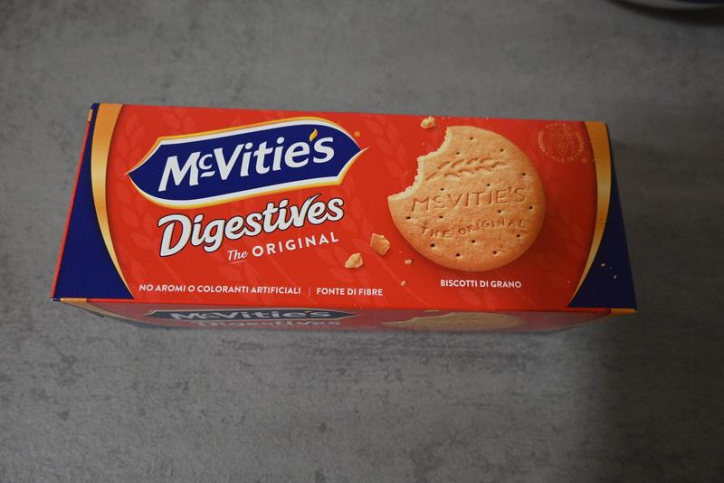

1. **L'inzuppo:** Tuffa i biscotti nel caffè **tiepido e zuccherato (a piacere)** per circa **10 secondi per lato** se usi i digestive.
2. **Primo strato:** Fodera il fondo della teglia senza lasciare spazi vuoti.

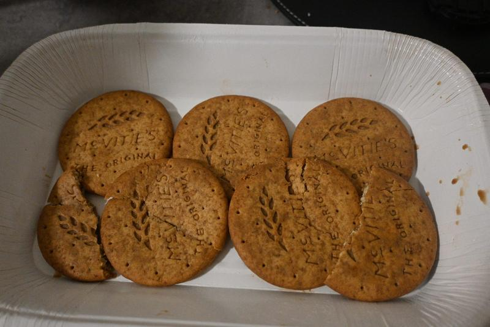

1. Versa **metà esatta** della crema sopra i biscotti e livella bene con la spatola o il dorso di un cucchiaio.

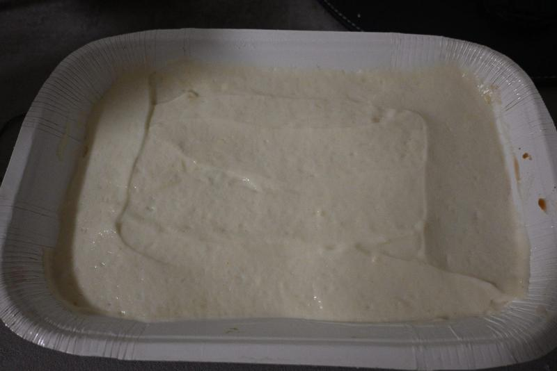

1. **Extra caffè:** Versa un filo di caffè tiepido sopra la crema per intensificare l'aroma dello strato intermedio.

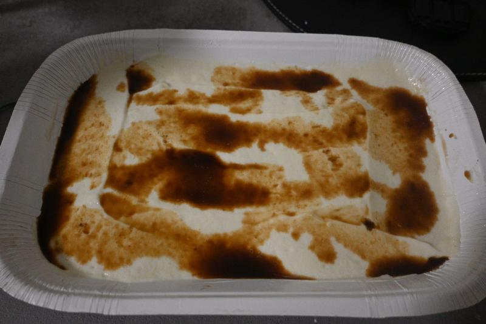

1. **Secondo strato:** Fai un altro piano di biscotti inzuppati. Se riesci, **incrociali rispetto ai primi** per dare più struttura alla fetta.

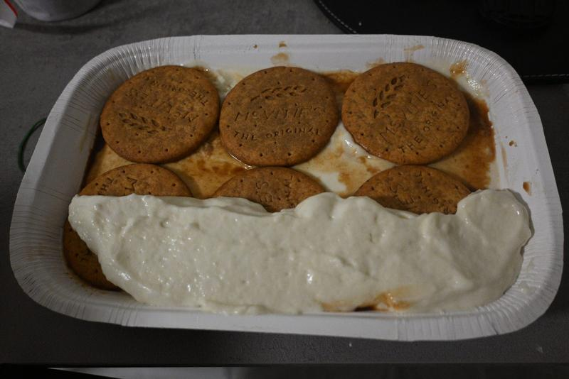

1. Se lo ritieni necessario, aggiungi un altro filo di caffè sopra i biscotti del secondo strato prima di coprire.
2. **Chiusura:** Versa tutto il resto della crema e liscia la superficie.

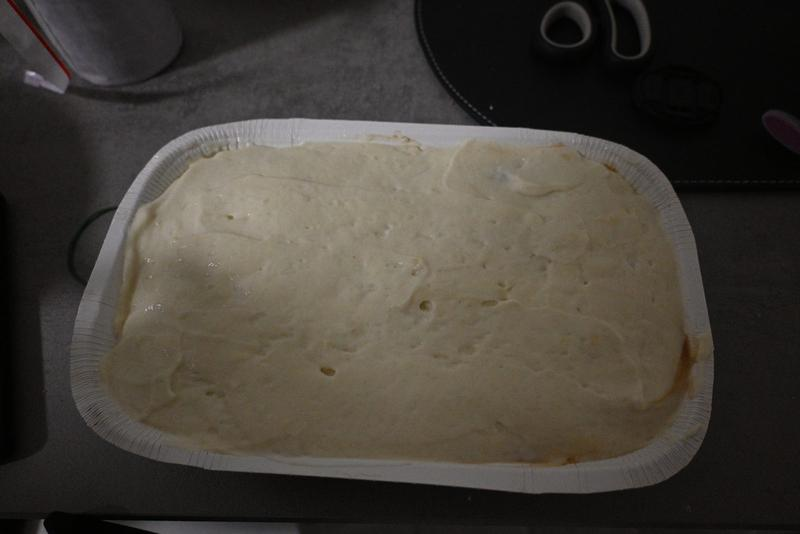

1. Aggiungere il cacao setacciato uniformemente sulla superficie appena ultimato l'ultimo strato.
  Solo al momento di portare in tavola, riapplicare un'altra spolverata per la presentazione finale.

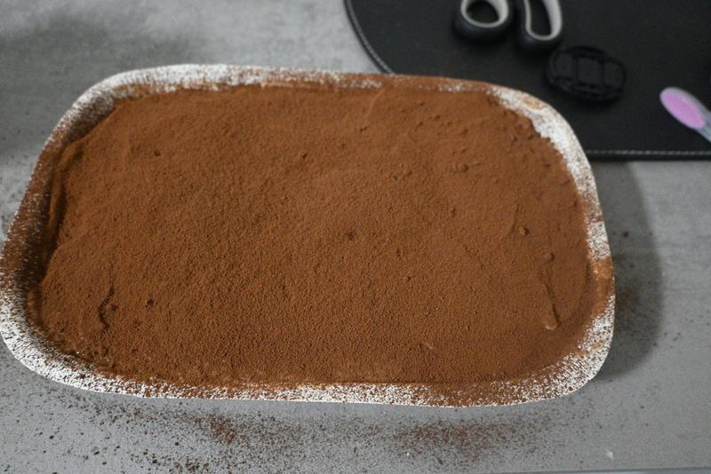

1. **Riposo in frigo:** Copri la teglia con pellicola trasparente tenendola tesa in modo che non tocchi la crema. Metti in frigorifero per almeno **6 ore**, meglio tutta la notte.

---

*Buon Tiramisù! 🌿*